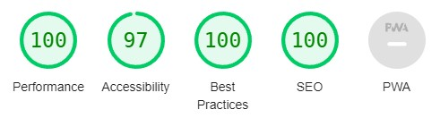
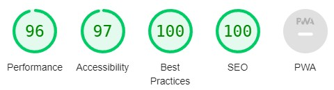
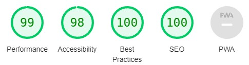
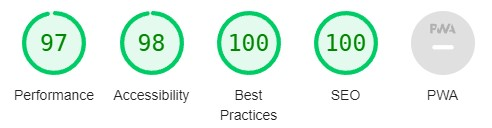
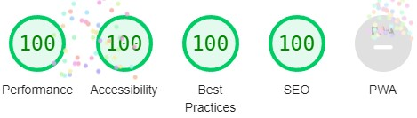
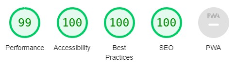

# Carrot

[LIVE PAGE](https://sarune95.github.io/carrot/)

# Design

Carrot digging game is designed for any age group of people, simple on the eye looking and easy to understand as we also give the support for the game itself. In this game you have to keep clicking till you collect reach your goals in order to win the game, there are supports for you as to upgrade the amount of carrots or simply to add additional carrots in order for you to win faster. You can play this game at any time anywhere as there is no time limit.

## Colors

The colors were chosen in order to obtain the best possible contrast performance. Also having a nice view for user, and best performance to navigate through content.

Vivid sky blue - background

Indigo dye - text

Pumpkin - buttons

Chosen colors giving triple A contrast between text and background.

## Fonts

Font style was selected as the browser's default to keep performance in mind.

# Features

Carrot web game has basic clicker game features. Main button increase value and goes together with other multipliers, like upgrades and helpers.

## Favicon

Nice logo picture gives user, easy way to distinct web site in browser's tabs.

## Logo

Shows web site name and picture, describing the game theme and what about it to the user.

## Welcome message

Web site meets user with a nice welcome message, and clear directions to start the game.

## Information

Describes how to play game. Clearly indicates available options in the game.

## Goals

Represents in game existing goals, and what takes to obtain them, also mentioning about end game goal requirement.

## 404

Also included 404 page in files directory with Carrot game theme and colors, which contains message and return link to website start page.

## Main game panel

In this panel on the left side is represented 3 game goals, after gathering required amount, they change from Unlock into achievement name. Right side representing game statistics which are obtained by user and personally chosen upgrades.

## Game button

Main game button which provides main game function to increase carrots count.

## Upgrades

Upgrades section includes three individual items. On the left show visual appearance, leading by details for individual upgraded and following to button to buy or upgrade.

## Friends

In this section represented all your available helpers. On left shows they'r personal picture, middle shows details and follows by button to hire them and upgrade, but best part friend brings carrots to user without pressing main game button, but good things came at pretty steep price then upgrades.

## Footer

Footer are simple contains only major social links.

## Error

This error message alert only when user try upgrade or hire friend with insufficient goods.

## End game goal

This message waiting everyone, but only shows up to mostly devoted users, which are chosen to gain enough carrots to reach end game.

# Automated testing

## HTML

HTML was validated using [https://validator.w3.org/](https://validator.w3.org/)

index.html 

game.html 

404.html 

## CSS

CSS was validated using [https://jigsaw.w3.org/css-validator/](https://jigsaw.w3.org/css-validator/)

## JavaScript

JavaScript was validated using [https://jshint.com](https://jshint.com)

Return no errors

was tested with enabled setting (New JavaScript features (ES6)) in configure option.

## Lighthouse

### Starter page

Desktop

Mobile

### Game page

Desktop

Mobile

### 404

Desktop

Mobile

# Manual testing

## Web site

### Home Page

| Feature | Test | Result |
| --- | --- | --- |
| Logo text | Testing with multiple resolution stays responsive readable | Stays responsive, readable |
| Logo image | Testing with multiple resolutions stays responsive | Stays responsive |
| Welcome message | Testing with multiple resolutions stays responsive and readable | Stays responsive, readable |
| Start game button | When clicked should enter game | Redirecting to the game |
| Start game button | Testing with multiple resolutions stays responsive and readable | Stays responsive, readable |
| Information text | Testing with multiple resolutions stays responsive and readable | Stays responsive, readable | 
| Goal text | Testing with multiple resolutions stays responsive and readable | Stays responsive, readable |
| Facebook link | When clicked should open facebook in new tab | Opens in new tab |
| Twitter link | When clicked should open twitter in new tab | Opens in new tab |
| Instagram link | When clicked should open instagram in new tab | Opens in new tab |
| Discord link | When clicked should open discord in new tab | Opens in new tab |

### Game page

| Feature | Test | Result |
| --- | --- | --- |
| Logo text | Testing with multiple resolution stays responsive and readable | Stays responsive, readable |
| Logo image | Testing with multiple resolutions stays responsive | Stays responsive |
| Goal list | Testing with multiple resolutions stays responsive and readable | Stays responsive, readable |
| Goal list | Records all goals on right amount goods | Records all goals|
| Info list | Testing with multiple resolutions stays responsive and readable | Stays responsive, readable |
| Info list | Records all statistics right | Shows right amount goods, records per click, records per second |
| Hit button | Testing with multiple resolutions stays responsive and readable | Stays responsive, readable |
| Hit button | Check if increase right amount goods | Increase correct amount |
| Upgrade item image | Testing with multiple resolutions stays responsive | Stays responsive |
| Upgrade item statistics | Testing with multiple resolution stays responsive and readable | Stays responsive, readable |
| Upgrade item statistics | Records correct levels and prices after upgrade | Shows right levels and price |
| Upgrade item button | Testing with multiple resolutions stays responsive and readable | Stays responsive, readable |
| Upgrade item button | Increase upgrade item levels and prices | Increase levels and prices |
| Friends item image | Testing with multiple resolutions stays responsive | Stays responsive |
| Friends item statistics | Testing with multiple resolution stays responsive and readable | Stays responsive, readable |
| Friends item statistics | Records correct levels and prices after upgrade | Shows right levels and price |
| Friends item button | Testing with multiple resolutions stays responsive and readable | Stays responsive, readable |
| Friends item button | Increase upgrade item levels and prices | Increase levels and prices |
| Facebook link | When clicked should open facebook in new tab | Opens in new tab |
| Twitter link | When clicked should open twitter in new tab | Opens in new tab |
| Instagram link | When clicked should open instagram in new tab | Opens in new tab |
| Discord link | When clicked should open discord in new tab | Opens in new tab |

### 404 page

| Feature | Test | Result |
| --- | --- | --- |
| Logo text | Testing with multiple resolution stays responsive readable | Stays responsive, readable |
| Logo image | Testing with multiple resolutions stays responsive | Stays responsive |
| Message | Testing with multiple resolution stays responsive and readable | Stays responsive, readable |
| Return button | Testing with multiple resolution stays responsive and readable | Stays responsive, readable |
| Return button | Returns to home page | Redirects to home page |
| Facebook link | When clicked should open facebook in new tab | Opens in new tab |
| Twitter link | When clicked should open twitter in new tab | Opens in new tab |
| Instagram link | When clicked should open instagram in new tab | Opens in new tab |
| Discord link | When clicked should open discord in new tab | Opens in new tab |

